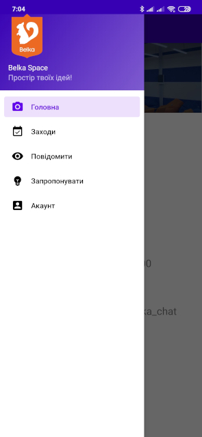

# BelkaApp
## Опис
Сьогодні популярними серед молоді (і не тільки) є відкриті простори, в яких ти можеш працювати, навчатися чи займатися іншими корисними справами. Вони є особливо актуальними для людей, чиє робоче місце не прив’язане до офісу чи кабінету. Особливо це стосується студентів, що не можуть сконцетруватися на навчанні в гуртожитку чи вдома. 
Мобільний додаток може спростити взаємодію між відвідувачами та адміністраторами коворкінгів. Розлоблений нами мобільний застосунок буде для будо полекшувати цю взаємодію для відвідувачів відкритого простору «Belka space». 

## Технології
* Kotlin
* Retrofit
* PostgreSQL
* Python
* Flask

## Screenshots

